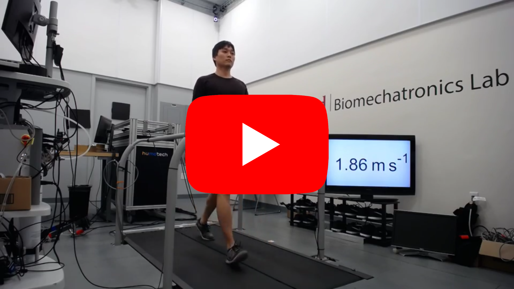
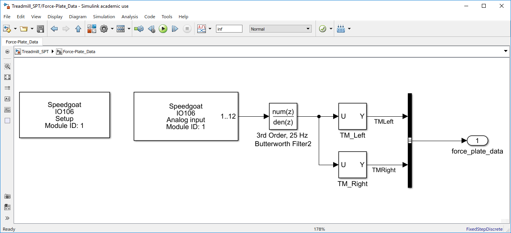
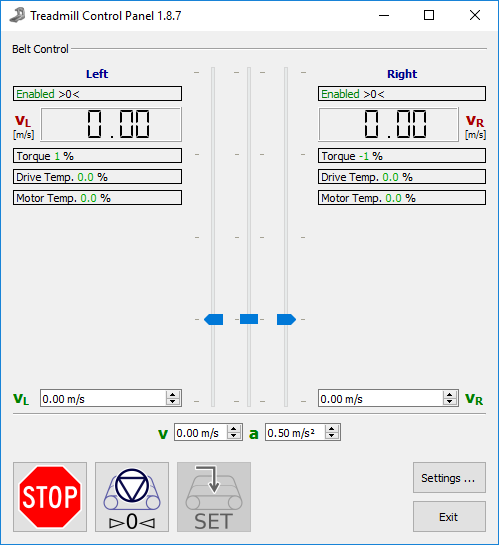
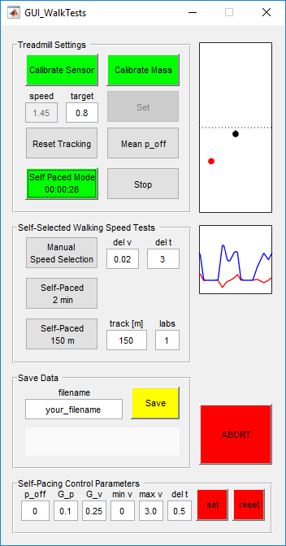

> [**Please fill out this survey**](https://docs.google.com/forms/d/1AhkLyk0r4jAx0c6DPpKsctpyo2noOiQ8uoqIybdXTvk/edit) if you are interested in using the self-pacing code.
It will help us to maintain/develop self-pacing controllers that match your need.

# Self-Paced Treadmill

This repository contains software that self-paces a force-instrumented treadmill to match walking (and running) speed.
The self-pacing controller for a Bertec instrumented treadmill is implemented in Matlab/Simulink Real-Time and runs on a real-time target machine (Speedgoat) at 1000 Hz that communicates with a host computer (e.g. a desktop) in 100 Hz.
The real-time target machine receives force-plate data from the treadmill, estimates subject speed and position based on the force data, and calculates the desired treadmill speed adjustment command that is sent to the host computer.
The host computer sends the speed adjustment command to the treadmill and interacts with a user through a graphical user interface.
Here, we explain how to [modify the code for your Speedgoat and Bertec instrumented treadmill setup](#modify-code-for-your-hardware-setup) and how to use two user interfaces: one for [a simple self-pacing function](#gui_spt) and the other to conduct [self-selected walking speed tests](#gui_walktests).

## Hardware setup
You need to setup the system so that the real-time target machine can read treadmill's force data, and a host computer (e.g. a desktop) can communicate with the target machine and the treadmill.
The remaining sections are for a setup with a Speedgoat real-time target machine, a Bertec instrucmented treadmill, and a host computer with Matlab/Simulink Real-Time.

## Modify code
The only part you need to change is the Simulink code that reads force plate data.

Modify `Treadmill_SPT.slx` > `Force-Plate_Data` block so that the block reads and outputs 12 force and moment values of the left and right plates.
Refer to Matlab and Speedgoat documents:
* [Add I/O Blocks to Simulink Model](https://www.mathworks.com/help/xpc/io_ref/adding-i-o-blocks-with-the-xpc-target-library.html)
* [Speedgoat analog input channels](https://www.speedgoat.com/help/slrt/page/io_main/refentry_ref_io106)

## Run software

You first need to allow remote TCP/IP control at your host computer using the Bertec Treadmill Control Panel to run our software.

1. Run Treadmill Control Panel
2. `Settings ...` > check `Remote Control` > check `TCP` > `OK`
4. `Enable Remote Control`

Also, calibrate the force-plates by pushing the `AUTOZERO` button on the Bertec analog amplifiers.

Now you are ready to run `main_SPT.m` on Matlab.
You can select one of the GUIs by setting:
* `i_gui = 1;` for [GUI_SPT](#gui_spt)
* `i_gui = 2;` for [GUI_WalkTests](#gui_walktests)

### GUI_SPT

* `Set`: Set the treadmill speed to value in `target`.
* `Stop`: Stop the treadmill.
* `Calibrate Sensor`: Zero the force-plate data. Make sure that no weight is on the treadmill. Button turns to green when done.
* `Calibrate Mass`: Measure subject data. Make sure the subject is standing still on the treadmill. The button turns to green when done.
* `Self-Paced Mode`: Start self-pacing controller. You can first make the subject walk at normal speed by the `Set` button then go to self-paced mode.
* `Reset Tracking`: Reset subject speed and position tracking. Not recommended to reset during self-paced mode.
* `Abort`: Abort software.
* `Self-Pacing Control Parameters` (see [paper](#reference) for details)
    - `p_off`: Position offset (eg. `p_off=-0.15` sets the default position 15 cm behind the center of the treadmill)
    - `G_p`: Position gain
    - `G_v`: Velocity gain
    - `min v`: Minimum speed the self-pacing controller can set
    - `max v`: Maximum speed the self-pacing controller can set
    - `del t`: Time duration to acheive speed adjustment (\Delta t_{tm,tgt} in the [paper](#reference))

### GUI_WalkTests

See [paper](#reference) for details on the tests.

* See [GUI_SPT](#gui_spt) for the common buttons.
* `Mean p_off`: Measures the average subject position while activated and prints it at the command window when finished (clicked again).
* `Manual Speed Selection`: Treadmill speed will change once activated (clicked). Deactivated it (click it again) once the subject indicates the speed is faster/slower than a comfortable speed.
* `Self-Paced 2 min`: Treadmill goes to the self-paced mode and relevant speed measures will be printed at eh command window. Deactivate it once the timer passes 2 minutes.
* `Self-Paced 150 m`: Treadmill goes to the self-paced mode and relevant speed measures will be printed at eh command window. A figure showing subject position on a 150 m virtual track will show up. Deactivate it once the subject passes the finish line.
* `Save`: Saves data in `your_filename.dat`.

## Reference

S Song, H Choi and SH Collins, Using force data to self-pace an instrumentedtreadmill and measure self-selected walking speed, *in preparation*.